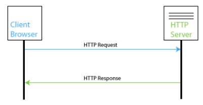

# HTTP Basics

## Hypertext Transfer Protocol (HTTP)

<!-- > To follow along with this exercise, you will need to download and un-zip this [starter kit](.zip). -->

Hypertext Transfer Protocol (better known simply as HTTP) is a communications protocol that has been designed for rapid distribution of hypertext (HTML) documents across networks. The protocol defines a client-server model, wherein clients send an HTTP request to a server that implements the protocol. The server, upon receiving the request, responds to the client.

> Figure 1: HTTP request and response

As you can see from the figure above, the client is responsible for initiating communication with the server by sending the initial request. The server must be listening for incoming requests from the network, and when a request received it will try to return the requested resource. Ideally the resource being requested is a simple HTML document (which most likely will have links to other required resources).

## Server-Side Resource Processing

The HTTP (web) server is responsible for processing the client's request and returning a response. The response may be the resource requested by the client, or it may be an error response indication that something has gone wrong. While the server was originally designed to transmit HTML documents, with the extension of Multipurpose Internet Mail Extension (MIME) types the HTTP server can also return a wide variety of file types.

In addition to serving static content/files, the server may also forward requests to be processed by other programs/services that are running on the server (i.e. PHP, ASP.NET, Ruby, etc.) These back-end processing engines can then execute scripts to manipulate data found in the request, interact with a database, manage a shopping cart, etc. The response created by these back-end engines is then passed back the server which in turn forwards it on to the client.

## HTTP Process

The process of HTTP is quite straight forward and consists generally of the following 4 operations:

1. Connection
2. Request
3. Response
4. Disconnection

### Connection

During the connection phase, the client initiates a TCP (typically, though TCP is not required) connection with the server. This connection process consists of three transferred packets, which are used to establish round-trip communication and initial connection parameter setup. The well-known port number for HTTP is 80, and this is assumed by modern browsers. If a HTTP server is listening on a port other than 80, then the port number must be explicitly defined in the URL for the request.

### Request

Once the TCP connection has been established, the client then sends a document request to the server. These requests are quite basic and consist of a line of ASCII characters terminated by a CR/LF (carriage return, line feed) pair. A well-behaved server will not require the carriage return character, but that is how the standard is documented. There are several request methods that can be used by the client (HEAD, GET, POST, PUT, DELETE) and each will be looked at later on.

### Response

In most cases, the request sent by the client will be a GET request. The response to a simple GET request is a message in hypertext mark-up language (HTML) that is simply returned to the client. This is a byte stream of ASCII characters whose lines may be of any length, although well-behaved servers should restrict line length to 80 characters excluding the CR/LF pair. Once the file has been sent by the server, the server attempts to close the connection.

### Disconnection

The TCP-IP connection is broken by the server when the whole document has been transferred; however, the client may abort the transfer by breaking the connection before this time, in which case the server shall not record any error condition.

One thing to note about this process is that requests are independent. What this means is that each request that is sent to the server has no relation to any previous request that has been sent. The server does not store any information about the request after the disconnection, and therefore HTTP is a stateless protocol. In order to maintain state, additional mechanisms must be used (i.e. cookies).

## HTTP Operation (HTTP 1.0 vs HTTP 1.1)

A good overview of improvements made to the HTTP protocol should be reviewed by any developer interested in application efficiency. The following links are good places to start:

- http://www8.org/w8-papers/5c-protocols/key/key.html
- http://en.wikipedia.org/wiki/Hypertext_Transfer_Protocol

## HTTP Methods

### Head

Sends a request to the server, but only for the response headers The response body should not be sent to the client

### Get

Makes a client request for an object based on the URI (uniform resource identifier)

Can send limited amount of data (visible) within the URL

Server responds with status code and the object if it decides that it can and is authorized to

- Status 100s – continue
- Status 200s – OK
- Status 300s – redirected
- Status 400s – client error
- Status 500s – server side error

### Post

Sends data to server (i.e. from forms) that is not visible in the body (not the URL)

Larger amount of data may be sent than is possible than with GET

Similar send / receive status process to that of GET

### Put

Attempts to upload a file/resource to the server

### Delete

Attempts to delete a file/resource from the server

